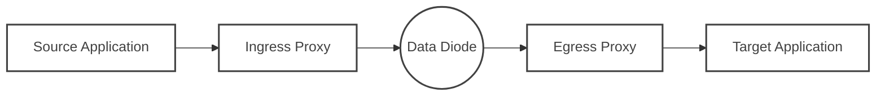

# Data Diode Connector (DDC)


[](https://artifacthub.io/packages/helm/ffutop/data-diode-connector-ingress)
[](https://artifacthub.io/packages/helm/ffutop/data-diode-connector-egress)

**Cloud-native, high-performance data transfer suite for unidirectional network environments.**

**🚀 Official Site:** [data-diode-connector.ffutop.com](https://data-diode-connector.ffutop.com/en/?utm_source=dockerhub&utm_medium=readme&utm_campaign=main_en)

## 📖 Introduction

**Data Diode Connector** is an engineering-grade software solution designed to bridge modern applications (like **Kafka**, **UDP**, **TCP**) with physical **Data Diodes** (unidirectional network devices / optical diodes).

Built entirely in **Rust**, **Data Diode Connector** ensures memory safety, ultra-low latency, and high throughput (supporting 10Gbps+ line rate). It is the ideal choice for **Critical Infrastructure**, **Industrial Control Systems (OT/ICS) Security**, and **Defense** environments that mandate strict physical/logical isolation.

### Why Data Diode Connector?

In a unidirectional network, the receiver cannot send "ACK" confirmations or flow control signals back to the sender. This prevents standard TCP connections from being established, while direct UDP traffic is prone to "silent packet loss" due to buffer overflows.

Data Diode Connector solves this challenge perfectly through the following mechanisms:
- **Application Layer Flow Control:** Proactively limits the sending rate to prevent physical diode buffer overflows.
- **Sequence Tracking:** Real-time detection and reporting of packet loss, ensuring visibility of data integrity.
- **Protocol Normalization:** Converts complex stateful protocols (like Kafka, MQTT) into streaming formats adapted for unidirectional transmission.

## ✨ Key Features

- **🦀 Rust-Driven Extreme Performance:** Utilizes lock-free ring buffers (`BipBuffer`) and zero-copy mechanisms to saturate 10Gbps bandwidth with minimal CPU usage.
- **🔒 Physical Isolation Ready:** Designed specifically for rigorous environments with **zero** return connections.
- **🛡️ Deep Security Defense:** Built-in WAF-grade **Filter Chain** supporting regex, keywords, and Schema validation, ensuring data is strictly scrubbed before leaving the secure zone.
- **⚡ Kafka Cross-Network Mirroring:** Natively supports mirroring Kafka Topics across unidirectional links without heavy components like MirrorMaker.
- **☁️ Cloud-Native Architecture:** Provides production-ready **Kubernetes (Helm)** and **Docker Compose** support. Integrated Prometheus metrics and structured logging.
- **📈 Full-Link Observability:** Real-time monitoring of packet loss rates (`packet_loss`) and throughput via StatsD/Prometheus.

## 🏗️ Architecture Design

DDC consists of two decoupled components that strictly follow a 1:1 pairing relationship:



*   **Ingress Proxy:** Responsible for data ingestion, security filtering, sequence number addition, and sending rate control.
*   **Egress Proxy:** Receives UDP streams, performs reordering, packet loss detection, data reassembly, and forwarding to the target system.

🔗 [View Full Architecture and Deployment Topologies](https://data-diode-connector.ffutop.com/en/software_architecture.html?utm_source=dockerhub&utm_medium=readme&utm_campaign=architecture_en)

## 🚀 Quick Start

### Docker Compose (Kafka Mirroring Example)

The following example demonstrates how to set up a unidirectional link to mirror a Kafka Topic.

```yaml
services:
  # 1. Ingress Proxy (Deployed in Source Network/High Security Zone)
  ddc-ingress:
    image: ffutop/ddc-ingress:latest
    environment:
      # Protocol Configuration
      - DDC_PROTOCOL_HANDLER_TYPE=kafka
      - DDC_PROTOCOL_HANDLER_KAFKA_HOST_KAFKA_SERVER=source-kafka:9092
      - DDC_PROTOCOL_HANDLER_KAFKA_TOPIC_NAME=critical-events
      # Transport Configuration
      - DDC_TRANSPORT_UDP_SEND_RECEIVER_ADDRESS=10.0.0.5 # Egress IP
      - DDC_TRANSPORT_UDP_SEND_RECEIVER_PORT=1234
      - DDC_TRANSPORT_UDP_SEND_SEND_DELAY_MS=1 # Flow Control (1ms interval per packet)

  # 2. Egress Proxy (Deployed in Destination Network/Low Security Zone)
  ddc-egress:
    image: ffutop/ddc-egress:latest
    ports:
      - "1234:1234/udp"
    environment:
      # Transport Configuration
      - DDC_TRANSPORT_UDP_RECEIVE_RECEIVER_PORT=1234
      # Protocol Configuration
      - DDC_PROTOCOL_HANDLER_TYPE=kafka
      - DDC_PROTOCOL_HANDLER_KAFKA_HOST_KAFKA_SERVER=target-kafka:9092
      - DDC_PROTOCOL_HANDLER_KAFKA_OUT_REPLACEMENT=mirrored-events
```

### Kubernetes (Helm)

We provide production-ready Helm Charts via ArtifactHub.

```bash
# Add repository
helm repo add ffutop https://ffutop.github.io/helm-charts
helm repo update

# Install Ingress Proxy (Source Side)
helm install ddc-ingress ffutop/data-diode-connector-ingress \
  --set protocolHandler.type=kafka \
  --set transportUdpSend.receiverAddress=10.0.0.5

# Install Egress Proxy (Destination Side)
helm install ddc-egress ffutop/data-diode-connector-egress \
  --set protocolHandler.type=kafka
```

🔗 [Detailed Configuration Reference](https://data-diode-connector.ffutop.com/en/configuration_reference.html?utm_source=dockerhub&utm_medium=readme&utm_campaign=helm_en)

## 📚 Documentation Resources

- **[Installation Guide](https://data-diode-connector.ffutop.com/en/download.html)** - Kubernetes, Docker, and Bare-metal deployment.
- **[Kernel Tuning Guide](https://data-diode-connector.ffutop.com/en/kernel_tuning.html)** - Optimizing Linux kernel to achieve 10 Gbps throughput.
- **[Security Model](https://data-diode-connector.ffutop.com/en/security_model.html)** - Threat analysis and memory safety mechanisms.
- **[Protocol Specification](https://data-diode-connector.ffutop.com/en/protocol.html)** - Low-level packet structure details.

## 🏢 Commercial & Support

The Data Diode Connector Community Edition is completely free and open source (Apache 2.0). For mission-critical scenarios, we offer a more powerful **Enterprise Edition**.

| Features | Community Edition | Enterprise Edition |
| :--- | :---: | :---: |
| **Core Engine (Rust)** | ✅ | ✅ |
| **10Gbps Line Rate Support** | ✅ | ✅ |
| **Kafka / UDP Support** | ✅ | ✅ |
| **Deep Packet Inspection (DPI)** | ❌ | ✅ |
| **Schema Validation (Avro/JSON)** | ❌ | ✅ |
| **LTS Binaries & SLA Support** | ❌ | ✅ |

[Contact Sales](mailto:sales@datadiodeconnector.com) or [View Pricing](https://data-diode-connector.ffutop.com/en/commercial.html?utm_source=dockerhub&utm_medium=readme&utm_campaign=commercial_en).

---

<p align="center">
  Copyright © 2025 ffutop.
</p>
