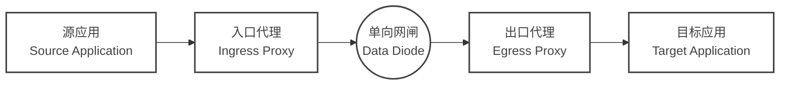

# 网闸连接器 (Data Diode Connector, DDC)


[](https://artifacthub.io/packages/helm/ffutop/data-diode-connector-ingress)
[](https://artifacthub.io/packages/helm/ffutop/data-diode-connector-egress)


**专为单向网络环境打造的云原生、高性能数据传输套件。**

**🚀 官方网站:** [data-diode-connector.ffutop.com](https://data-diode-connector.ffutop.com/zh-CN/?utm_source=dockerhub&utm_medium=readme&utm_campaign=main_cn)

## 📖 简介

**网闸连接器** 是一款工程级的软件解决方案，旨在桥接现代应用（如 **Kafka**、**UDP**、**TCP**）与物理**单向网闸**（网络单向导入导出设备 / 光闸）。

**网闸连接器**完全基于 **Rust** 构建，确保了内存安全、极低延迟和超高吞吐量（支持 10Gbps+ 线速），是**关键信息基础设施**、**工业控制系统 (OT/ICS) 安全**以及**国防**等强制要求物理/逻辑隔离环境的理想选择。

### 为什么需要网闸连接器?

在单向网络中，接收端无法向发送端回传 "ACK" 确认或流控信号。这导致标准的 TCP 连接无法建立，而直接发送 UDP 流量则极易因缓冲区溢出导致“静默丢包”。

网闸连接器通过以下机制完美解决了这一难题：
- **应用层流控 (Flow Control):** 主动限制发送速率，防止物理网闸缓冲区溢出。
- **序列追踪 (Sequence Tracking):** 实时检测并报告丢包情况，确保数据完整性可视。
- **协议标准化 (Protocol Normalization):** 将复杂的有状态协议（如 Kafka, MQTT）转换为适应单向传输的流式格式。

## ✨ 核心特性

- **🦀 Rust 驱动的极致性能:** 利用无锁环形缓冲区 (`BipBuffer`) 和零拷贝机制，在极低的 CPU 占用下跑满万兆带宽。
- **🔒 物理隔离就绪:** 专为**零**反向连接的严苛环境设计。
- **🛡️ 深度安全防御:** 内置 WAF 级**过滤器链 (Filter Chain)**，支持正则、关键字、Schema 校验，确保数据在离开安全区前经过严格清洗。
- **⚡ Kafka 跨网镜像:** 原生支持跨单向链路镜像 Kafka Topic，无需引入 MirrorMaker 等笨重组件。
- **☁️ 云原生架构:** 提供生产级的 **Kubernetes (Helm)** 和 **Docker Compose** 支持。集成 Prometheus 指标和结构化日志。
- **📈 全链路可观测:** 通过 StatsD/Prometheus 实时监控丢包率 (`packet_loss`) 和吞吐量。

## 🏗️ 架构设计

DDC 包含两个解耦的组件，它们严格遵循 1:1 的配对关系：



*   **入口代理 (Ingress Proxy):** 负责数据采集、安全过滤、添加序列号，并进行发送速率控制。
*   **出口代理 (Egress Proxy):** 接收 UDP 流，进行乱序重排、丢包检测、数据重组，并转发给目标系统。

🔗 [查看完整架构与部署拓扑](https://data-diode-connector.ffutop.com/zh-CN/software_architecture.html?utm_source=dockerhub&utm_medium=readme&utm_campaign=architecture_cn)

## 🚀 快速开始

### Docker Compose (Kafka 镜像示例)

以下示例展示了如何搭建一条单向链路来镜像 Kafka Topic。

```yaml
services:
  # 1. 入口代理 (部署在源端网络/高密区)
  ddc-ingress:
    image: ffutop/ddc-ingress:latest
    environment:
      # 协议配置
      - DDC_PROTOCOL_HANDLER_TYPE=kafka
      - DDC_PROTOCOL_HANDLER_KAFKA_HOST_KAFKA_SERVER=source-kafka:9092
      - DDC_PROTOCOL_HANDLER_KAFKA_TOPIC_NAME=critical-events
      # 传输配置
      - DDC_TRANSPORT_UDP_SEND_RECEIVER_ADDRESS=192.168.1.100 # 出口端 IP
      - DDC_TRANSPORT_UDP_SEND_RECEIVER_PORT=1234
      - DDC_TRANSPORT_UDP_SEND_SEND_DELAY_MS=1 # 流控 (每包间隔 1ms)

  # 2. 出口代理 (部署在目的端网络/低密区)
  ddc-egress:
    image: ffutop/ddc-egress:latest
    ports:
      - "1234:1234/udp"
    environment:
      # 传输配置
      - DDC_TRANSPORT_UDP_RECEIVE_RECEIVER_PORT=1234
      # 协议配置
      - DDC_PROTOCOL_HANDLER_TYPE=kafka
      - DDC_PROTOCOL_HANDLER_KAFKA_HOST_KAFKA_SERVER=target-kafka:9092
      - DDC_PROTOCOL_HANDLER_KAFKA_OUT_REPLACEMENT=mirrored-events
```

### Kubernetes (Helm)

我们通过 ArtifactHub 提供生产就绪的 Helm Charts。

```bash
# 添加仓库
helm repo add ffutop https://ffutop.github.io/helm-charts
helm repo update

# 安装入口代理 (源端)
helm install ddc-ingress ffutop/data-diode-connector-ingress \
  --set protocolHandler.type=kafka \
  --set transportUdpSend.receiverAddress=10.0.0.5

# 安装出口代理 (目的端)
helm install ddc-egress ffutop/data-diode-connector-egress \
  --set protocolHandler.type=kafka
```

🔗 [详细配置参数参考手册](https://data-diode-connector.ffutop.com/zh-CN/configuration_reference.html?utm_source=dockerhub&utm_medium=readme&utm_campaign=helm_cn)

## 📚 文档资源

- **[安装指南](https://data-diode-connector.ffutop.com/zh-CN/download.html)** - Kubernetes, Docker 及裸机部署。
- **[内核调优指南](https://data-diode-connector.ffutop.com/zh-CN/kernel_tuning.html)** - 优化 Linux 内核以实现 10 Gbps 吞吐。
- **[安全模型](https://data-diode-connector.ffutop.com/zh-CN/security_model.html)** - 威胁分析与内存安全机制。
- **[协议规范](https://data-diode-connector.ffutop.com/zh-CN/protocol.html)** - 底层数据包结构细节。

## 🏢 商业版与支持

网闸连接器社区版完全免费且开源 (Apache 2.0)。针对关键任务场景，我们提供功能更强大的 **企业版 (Enterprise Edition)**。

| 功能特性 | 社区版 (Community) | 企业版 (Enterprise) |
| :--- | :---: | :---: |
| **核心引擎 (Rust)** | ✅ | ✅ |
| **10Gbps 线速支持** | ✅ | ✅ |
| **Kafka / UDP 支持** | ✅ | ✅ |
| **深度包检测 (DPI)** | ❌ | ✅ |
| **Schema 校验 (Avro/JSON)** | ❌ | ✅ |
| **LTS 二进制与 SLA 支持** | ❌ | ✅ |

[联系销售](mailto:sales@datadiodeconnector.com) 或 [查看定价](https://data-diode-connector.ffutop.com/zh-CN/commercial.html?utm_source=dockerhub&utm_medium=readme&utm_campaign=commercial_cn).

---

<p align="center">
  Copyright © 2025 ffutop.
</p>
