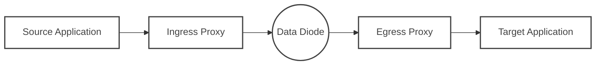
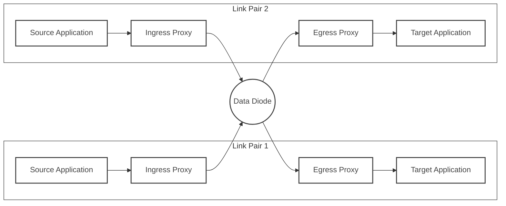
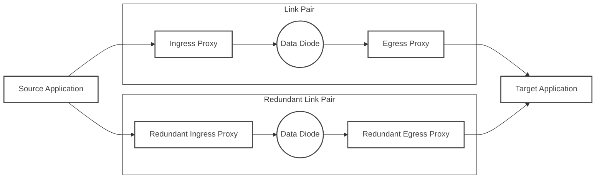
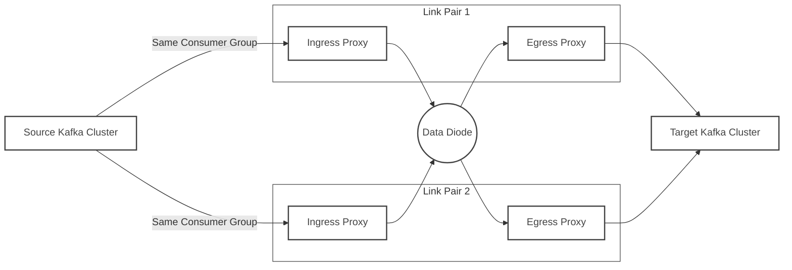

# Deployment Topologies & High Availability

In enterprise environments, deploying the Data Diode Connector (DDC) must follow a **strict one-to-one binding principle**. This document outlines architectural patterns and **High Availability (HA)** strategies based on this core constraint.

## Core Architecture Principle: Single Logical Processing Unit

According to the [Protocol Design](/en/protocol) of the Data Diode Connector, the **Ingress Proxy and Egress Proxy constitute a single logical processing unit**.

- **Strict One-to-One Mapping**: Every Ingress Proxy instance must correspond to a dedicated Egress Proxy instance.
- **No Reuse**: It does **NOT** support multiple Ingress instances sending to the same Egress instance, nor does it support one Ingress distributing to multiple Egress instances.

### Rationale
The Ingress and Egress proxies maintain a state machine for a single data stream (including [sequence number tracking](/en/protocol#header-fields) and fragmentation/reassembly state). If multiple Ingress proxies send data to the same Egress proxy, it causes sequence number conflicts and state confusion at the receiver, leading to severe packet loss and reassembly failures.

Therefore, all scaling and high-availability designs must be based on **paired Ingress and Egress proxies**.

## Deployment Patterns

The Data Diode Connector supports Kubernetes and Docker Compose deployments, but you must strictly adhere to the pairing principle mentioned above.

### Single Link Pair Pattern

The most basic deployment unit.

- **Configuration**:
    - The [Ingress Proxy](/en/configuration_reference#ingress-proxy-configuration) is configured with a unique destination UDP address/port.
    - The [Egress Proxy](/en/configuration_reference#egress-proxy-configuration) listens on the corresponding UDP port.

### Multi-Link Pair Pattern

The Multi-Link Pair pattern is suitable for scenarios requiring simultaneous processing of multiple data streams, where each link pair is responsible for independent traffic isolation.

- **Configuration**:
    - The Ingress Proxy of each link pair is configured with a unique destination UDP address/port.
    - Each Egress Proxy listens on its corresponding UDP port.

## High Availability (HA) Strategies

Given the 1:1 restriction, High Availability cannot be achieved through simple "backend cluster load balancing"; it must adopt a **multi-link parallel** strategy.

### Redundant Link Mode (Active-Active Replication)

This is the recommended architecture for **maximum reliability**, tolerating failures of any component (including physical data diode hardware).

- **Traffic Flow**:
    - **Source**: The business application sends the same data to both the Ingress Proxy and the Redundant Ingress Proxy simultaneously (Traffic Mirroring).
    - **Transmission**: The two links transmit data independently.
    - **Destination**: The target application receives two copies of the data (from the Redundant Egress Proxy and the Egress Proxy respectively).
- **Deduplication Requirement**: The target business system must have **deduplication logic** (e.g., based on unique IDs in the business data) to handle duplicate data packets arriving from both paths.

### Kafka Consumer Group Failover Mode (Active-Active Sharding)

Leverages Kafka's consumer group mechanism to achieve automatic load distribution and failover, while maintaining the singularity of the Ingress output stream.

- **Failover Process**:
    - Under normal circumstances, Kafka distributes Partitions to the Ingress Proxies of Link Pair 1 and Link Pair 2.
    - If the Ingress Proxy of Link Pair 1 crashes, Kafka triggers a Rebalance, reassigning the Partitions originally belonging to Link Pair 1 to the Ingress Proxy of Link Pair 2.
    - At this point, the Ingress Proxy of Link Pair 2 carries double the traffic, but for the Egress Proxy of Link Pair 2, it still receives valid sequential data from a single source (Link Pair 2's Ingress), **complying with the 1:1 protocol requirement**.
- **Prerequisites**:
    - The Ingress Proxy of each link pair must run as a [Kafka Consumer](/en/configuration_reference#kafka-mode-protocolhandlerkafka).
    - Sufficient physical channels (ports) must be planned for use by each Ingress-Egress pair.

### Cold Standby Mode (Active-Passive)

Suitable for scenarios where momentary downtime (seconds) is acceptable.

- **Mechanism**:
    - Use Kubernetes `Deployment` (Replicas=1).
    - Or Docker Compose with `restart: always`.
- **Failure Recovery**: When an Ingress or Egress proxy process crashes, the container orchestration platform automatically restarts the instance.
- **Limitations**: Data transmission is interrupted during the restart.

## The "Blind Sender" Problem & Monitoring

In a unidirectional network, each Ingress Proxy **cannot know** if its corresponding Egress Proxy is functioning correctly.

### Mitigation Strategies
Since we now adopt a strict pairing pattern, monitoring becomes more explicit:

1. **Out-of-Band Monitoring**:
    - If conditions permit (e.g., existence of a management network segment), an external monitoring system should be established to check the health status of all Ingress and Egress proxies simultaneously.
    - If any Egress Proxy is found to be down, an automated script should stop the corresponding Ingress Proxy, forcing the upstream (e.g., Kafka) to shift traffic to a healthy link.

2. **Heartbeat Detection**:
    - The protocol includes `HeartBeat` messages. The Egress Proxy should monitor the receipt of heartbeats. If no heartbeat is received from the Ingress Proxy for a long time, it should raise an alarm indicating "Link Interrupted".

## Summary Recommendations

| Requirement | Recommended Architecture | Key Configuration |
| :--- | :--- | :--- |
| **Standard Production** | **Kafka Group Mode** | Multiple Ingress Proxies consume as the same group; each Ingress binds to an independent Egress; relies on Kafka Rebalance for fault tolerance. |
| **Maximum Reliability** | **Redundant Link (Dual Send)** | Source sends dual traffic; deploy two independent links; destination handles deduplication. |
| **Resource Constrained/Simple** | **K8s Cold Standby** | Single Pod pair; relies on K8s auto-restart. |

**Note**: Whenever scaling, you must increase both Ingress and Egress proxies simultaneously and configure independent communication ports/channels. Multi-to-one topology is strictly prohibited.