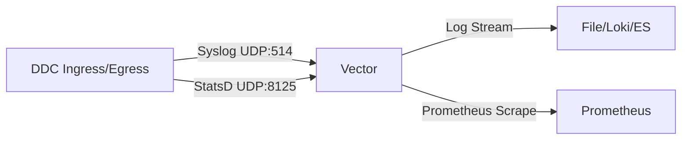

# DDC 架构迭代与优化路线图 (2025)

## 1. 背景与目标

随着 Data Diode Connector (DDC) 部署环境的多样化（如 ARM64 边缘设备）以及上游中间件（Kafka 4.x）的演进，当前版本在**可观测性基础设施**和**核心协议兼容性**方面暴露出了局限性。

本文档旨在详细分析当前面临的两个核心问题，并提出具体的架构调整方案与实施路线图。

---

## 2. 问题分析

### 2.1. 问题一：可观测性组件在 ARM 架构下的兼容性与功能缺失

**现状：**
*   当前使用 `fluent-bit` 作为日志收集器。
*   **Crash 问题**：在 ARM64 (aarch64) 架构下，`fluent-bit` 默认集成的内存分配器 `jemalloc` 与部分 Linux 内核的透明大页 (THP) 或 64k 页大小配置存在冲突，导致 Segmentation Fault 无法启动。
*   **指标缺失**：当前的 `fluent-bit` 配置未正确处理 DDC 发送的 StatsD 指标，导致监控数据（如 `dropped_packets`, `bytes_sent`）丢失。虽然部署目录中有 `telegraf.conf`，但架构上显得割裂（日志走 Fluent，指标走 Telegraf）。

**影响：**
*   边缘设备（常为 ARM 架构）部署困难。
*   运维人员无法获得丢包率、吞吐量等关键运行指标，变成了“盲飞”。

### 2.2. 问题二：Kafka 客户端协议过时

**现状：**
*   DDC 的 `ph_kafka` 模块依赖于 `rust-kafka` crate。
*   `rust-kafka` 是一个纯 Rust 实现，但维护活跃度较低，且主要支持 Kafka 0.8.x - 2.x 的旧版协议 API。
*   **不兼容未来**：Kafka 4.0+ (KRaft mode) 正在逐步弃用和移除旧版协议支持。

**影响：**
*   无法连接最新的 Kafka 集群。
*   不支持 SASL/SCRAM 等现代认证机制（或支持有限）。
*   性能与稳定性不如经过工业级验证的客户端。

---

## 3. 解决方案与技术选型

### 3.1. 可观测性重构：迁移至 Vector

为了解决 ARM 兼容性并统一日志与指标收集，建议弃用 `fluent-bit`，迁移至 **Vector**。

**选型理由：**
1.  **Rust 生态统一**：Vector 也是用 Rust 编写的，与 DDC 的技术栈同源，内存安全且高性能。
2.  **原生 ARM 支持**：Vector 在 ARM64 上的构建和运行非常稳定，且不依赖 `jemalloc` 的特定 hack。
3.  **统一管道**：Vector 可以同时作为 Syslog Server (UDP/TCP) 和 StatsD Server。它可以将日志清洗后发往 Elasticsearch/File，同时将 StatsD 指标聚合后暴露为 Prometheus Metrics。
4.  **配置灵活**：使用 VRL (Vector Remap Language) 可以极其灵活地处理 DDC 的结构化日志。

**架构变更预览：**



### 3.2. Kafka 客户端升级：迁移至 rdkafka

为了支持 Kafka 4.x 及更高性能，建议将底层依赖从 `rust-kafka` 迁移至 **`rdkafka`**。

**选型理由：**
1.  **行业标准**：`rdkafka` 是 `librdkafka` (C库) 的 Rust 绑定。`librdkafka` 是除 Java 官方客户端外最权威、功能最全、性能最高的 Kafka 客户端实现。
2.  **协议支持**：第一时间支持 Kafka 新特性（如 Transaction, Idempotency, Zstd compression, Modern SASL）。
3.  **稳定性**：经过了大规模生产环境验证。

**挑战与对策：**
*   **构建复杂性**：`rdkafka` 依赖 C 库 (`openssl`, `sasl`, `zstd`)。
*   **对策**：在 `Cargo.toml` 中启用 `cmake-build` 特性，并在 Dockerfile 构建阶段（Multi-stage build）安装必要的 C 编译工具链。虽然这会增加编译时间，但运行时性能和兼容性收益巨大。

---

## 4. 实施细节与代码改造

### 4.1. Vector 配置示例 (替代 Fluent-bit)

创建新的配置文件 `deploy/vector/vector.toml`：

```toml
[api]
enabled = true
address = "0.0.0.0:8686"

# 1. 接收 DDC 的 Syslog
[sources.ddc_logs]
type = "syslog"
address = "0.0.0.0:514"
mode = "udp"

# 2. 接收 DDC 的 StatsD 指标
[sources.ddc_metrics]
type = "statsd"
address = "0.0.0.0:8125"
mode = "udp"

# 3. 处理日志 (例如解析 JSON)
[transforms.parse_logs]
type = "remap"
inputs = ["ddc_logs"]
source = '''
. = parse_json(.message) ?? .
'''

# 4. 输出日志到控制台 (或文件/Loki)
[sinks.console_out]
type = "console"
inputs = ["parse_logs"]
encoding.codec = "json"

# 5. 将指标暴露给 Prometheus
[sinks.prometheus_exporter]
type = "prometheus_exporter"
inputs = ["ddc_metrics"]
address = "0.0.0.0:9090"
```

### 4.2. Kafka 代码重构 (Rust)

**修改 `protocol_handlers/ph_kafka/Cargo.toml`:**

```toml
[dependencies]
# 移除 rust-kafka
# kafka = "0.8" 

# 添加 rdkafka
rdkafka = { version = "0.34", features = ["ssl", "sasl", "gssapi"] }
tokio = { version = "1", features = ["full"] } # rdkafka 通常配合 async 使用
```

**修改 `consumer.rs` (伪代码思路):**

原 `rust-kafka` 是同步阻塞模型，`rdkafka` 推荐使用 `Stream` 异步模型，但为了保持 DDC 现有的线程模型，可以使用 `BaseConsumer` (同步) 或在 DDC 现有线程中运行 `Runtime`。

建议：由于 DDC 核心是基于 `std::thread` 的，使用 `rdkafka::consumer::BaseConsumer` 是最平滑的迁移路径。

```rust
use rdkafka::config::ClientConfig;
use rdkafka::consumer::{BaseConsumer, Consumer};

pub fn run(config: &KafkaConfig, buffer: &BipBufferWriter) {
    let consumer: BaseConsumer = ClientConfig::new()
        .set("bootstrap.servers", &config.host)
        .set("group.id", "ddc-group")
        .set("enable.auto.commit", "true")
        .create()
        .expect("Consumer creation failed");

    consumer.subscribe(&[&config.topic]).expect("Can't subscribe");

    loop {
        // Poll for messages
        match consumer.poll(Duration::from_millis(100)) {
            Some(Ok(msg)) => {
                if let Some(payload) = msg.payload() {
                    // 写入 RingBuffer
                }
            },
            Some(Err(e)) => log::error!("Kafka error: {}", e),
            None => {}, // Idle
        }
    }
}
```

---

## 5. 迭代计划

### 阶段一：基础设施升级 (v1.1.0)
*   [ ] **任务**: 创建 `deploy/vector` 目录及配置。
*   [ ] **任务**: 更新 `Dockerfile` 和 Kubernetes Helm Charts，将 Sidecar 从 Fluent-bit 替换为 Vector。
*   [ ] **验证**: 在 ARM64 (如 Raspberry Pi 或 AWS Graviton) 上部署，验证无 Crash。
*   [ ] **验证**: 访问 Vector 的 Prometheus 端点，确认能看到 `ddc_ingress_packets_sent` 等指标。

### 阶段二：Kafka 核心升级 (v1.2.0)
*   [ ] **任务**: 重构 `ph_kafka` crate，替换依赖为 `rdkafka`。
*   [ ] **任务**: 更新 Docker 构建环境，安装 `libssl-dev`, `libsasl2-dev`, `cmake`。
*   [ ] **任务**: 更新 `Config.toml` 结构（如果需要新的配置项，如 `sasl_mechanism`）。
*   [ ] **测试**: 使用 Kafka 3.x 和 4.x (Preview) 进行连通性测试。
