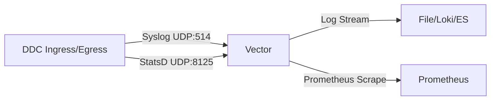

# Architecture Optimization Roadmap (2025)

## 1. Background & Objectives

As the Data Diode Connector (DDC) deployment environments diversify (e.g., **ARM64** edge devices) and upstream middleware evolves (e.g., **Kafka 4.x**), the current version has exposed limitations in **observability infrastructure** and **core protocol compatibility**.

This document details the analysis of two core issues and proposes a concrete architectural adjustment and implementation roadmap.

---

## 2. Problem Analysis

### 2.1. Issue 1: Observability Component Compatibility on ARM

**Current Status:**
*   Using `fluent-bit` as the log collector.
*   **Crash Issue**: On **ARM64 (aarch64)** architecture, `fluent-bit`'s default memory allocator `jemalloc` conflicts with Transparent Huge Pages (THP) or 64k page size configurations in some Linux kernels, causing Segmentation Faults on startup.
*   **Missing Metrics**: The current `fluent-bit` configuration does not correctly handle StatsD metrics sent by DDC, leading to loss of monitoring data (e.g., `dropped_packets`, `bytes_sent`). Although `telegraf.conf` exists in the deploy directory, the architecture feels fragmented (Logs via Fluent, Metrics via Telegraf).

**Impact:**
*   Difficult deployment on edge devices (often ARM-based).
*   Operators are "flying blind" without key operational metrics like packet loss rate and throughput.

### 2.2. Issue 2: Outdated Kafka Client Protocol

**Current Status:**
*   DDC's `ph_kafka` module depends on the `rust-kafka` crate.
*   `rust-kafka` is a pure Rust implementation but has low maintenance activity and mainly supports older Kafka 0.8.x - 2.x protocol APIs.
*   **Future Incompatibility**: Kafka 4.0+ (KRaft mode) is gradually deprecating and removing support for older protocols.

**Impact:**
*   Inability to connect to the latest Kafka clusters.
*   Limited or no support for modern authentication mechanisms like SASL/SCRAM.
*   Performance and stability lag behind industrial-grade client implementations.

---

## 3. Solutions & Technology Selection

### 3.1. Observability Refactoring: Migrate to Vector

To resolve ARM compatibility and unify log/metric collection, we propose deprecating `fluent-bit` in favor of **[Vector](https://vector.dev/)**.

**Why Vector?**
1.  **Unified Rust Ecosystem**: Vector is also written in Rust, sharing the same technology stack as DDC, ensuring memory safety and high performance.
2.  **Native ARM Support**: Vector builds and runs stably on ARM64 without relying on specific `jemalloc` hacks.
3.  **Unified Pipeline**: Vector can act as both a Syslog Server (UDP/TCP) and a StatsD Server. It can cleanse logs before sending them to Elasticsearch/File, and aggregate StatsD metrics to expose them as Prometheus Metrics.
4.  **Flexible Configuration**: The Vector Remap Language (VRL) allows for extremely flexible processing of DDC's structured logs.

**Architecture Change Preview:**



### 3.2. Kafka Client Upgrade: Migrate to rdkafka

To support Kafka 4.x and higher performance, we suggest migrating the underlying dependency from `rust-kafka` to **`rdkafka`**.

**Why rdkafka?**
1.  **Industry Standard**: `rdkafka` is the Rust binding for `librdkafka` (C library). `librdkafka` is the most authoritative, feature-rich, and performant Kafka client implementation outside of the official Java client.
2.  **Protocol Support**: Day-one support for new Kafka features (e.g., Transaction, Idempotency, Zstd compression, Modern SASL).
3.  **Stability**: Proven in large-scale production environments.

**Challenges & Mitigation:**
*   **Build Complexity**: `rdkafka` depends on C libraries (`openssl`, `sasl`, `zstd`).
*   **Mitigation**: Enable the `cmake-build` feature in `Cargo.toml` and install necessary C compilation toolchains during the Dockerfile build stage (Multi-stage build). While this increases compile time, the runtime performance and compatibility gains are immense.

---

## 4. Implementation Details

### 4.1. Vector Configuration Example (Replacing Fluent-bit)

Create a new configuration file `deploy/vector/vector.toml`:

```toml
[api]
enabled = true
address = "0.0.0.0:8686"

# 1. Receive DDC Syslog
[sources.ddc_logs]
type = "syslog"
address = "0.0.0.0:514"
mode = "udp"

# 2. Receive DDC StatsD Metrics
[sources.ddc_metrics]
type = "statsd"
address = "0.0.0.0:8125"
mode = "udp"

# 3. Process Logs (e.g., Parse JSON)
[transforms.parse_logs]
type = "remap"
inputs = ["ddc_logs"]
source = '''
. = parse_json(.message) ?? .
'''

# 4. Output Logs to Console (or File/Loki)
[sinks.console_out]
type = "console"
inputs = ["parse_logs"]
encoding.codec = "json"

# 5. Expose Metrics to Prometheus
[sinks.prometheus_exporter]
type = "prometheus_exporter"
inputs = ["ddc_metrics"]
address = "0.0.0.0:9090"
```

### 4.2. Kafka Code Refactoring (Rust)

**Modify `protocol_handlers/ph_kafka/Cargo.toml`:**

```toml
[dependencies]
# Remove rust-kafka
# kafka = "0.8" 

# Add rdkafka
rdkafka = { version = "0.34", features = ["ssl", "sasl", "gssapi"] }
tokio = { version = "1", features = ["full"] } # rdkafka is often used with async
```

**Modify `consumer.rs` (Pseudo-code Idea):**

Original `rust-kafka` is a synchronous blocking model. `rdkafka` recommends using the `Stream` async model, but to maintain DDC's existing threading model, we can use `BaseConsumer` (Synchronous) or run a `Runtime` within the existing DDC thread.

Recommendation: Since DDC core is based on `std::thread`, using `rdkafka::consumer::BaseConsumer` is the smoothest migration path.

```rust
use rdkafka::config::ClientConfig;
use rdkafka::consumer::{BaseConsumer, Consumer};

pub fn run(config: &KafkaConfig, buffer: &BipBufferWriter) {
    let consumer: BaseConsumer = ClientConfig::new()
        .set("bootstrap.servers", &config.host)
        .set("group.id", "ddc-group")
        .set("enable.auto.commit", "true")
        .create()
        .expect("Consumer creation failed");

    consumer.subscribe(&[&config.topic]).expect("Can't subscribe");

    loop {
        // Poll for messages
        match consumer.poll(Duration::from_millis(100)) {
            Some(Ok(msg)) => {
                if let Some(payload) = msg.payload() {
                    // Write to RingBuffer
                }
            },
            Some(Err(e)) => log::error!("Kafka error: {}", e),
            None => {}, // Idle
        }
    }
}
```

---

## 5. Iteration Plan

### Phase 1: Infrastructure Upgrade (v1.1.0)
*   [ ] **Task**: Create `deploy/vector` directory and configuration.
*   [ ] **Task**: Update `Dockerfile` and Kubernetes Helm Charts, replacing the Fluent-bit sidecar with Vector.
*   [ ] **Verify**: Deploy on ARM64 (e.g., Raspberry Pi or AWS Graviton) and verify no crashes.
*   [ ] **Verify**: Access Vector's Prometheus endpoint and confirm metrics like `ddc_ingress_packets_sent` are visible.

### Phase 2: Kafka Core Upgrade (v1.2.0)
*   [ ] **Task**: Refactor `ph_kafka` crate, replacing dependency with `rdkafka`.
*   [ ] **Task**: Update Docker build environment, installing `libssl-dev`, `libsasl2-dev`, `cmake`.
*   [ ] **Task**: Update `Config.toml` structure (if new config items are needed, e.g., `sasl_mechanism`).
*   [ ] **Test**: Connectivity testing with Kafka 3.x and 4.x (Preview).