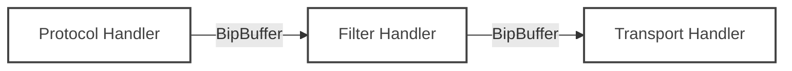

# Software Architecture

The Data Diode Connector (DDC) is designed as a high-performance, modular software suite that facilitates secure, unidirectional data transfer. This document outlines the software architecture, component interactions, and data flow principles that drive the system.

## High-Level Overview

    <!-- Background Grid Pattern -->
    

    

        <!-- Ingress Node -->
        

            

                

                    

                        <i class="fa-solid fa-cloud-arrow-down text-zinc-700"></i>
                    

                    

                        <h3 class="font-semibold text-sm text-zinc-900 !my-0">Ingress Proxy</h3>
                        
High Security Side

                    

                

                

                    

                        <i class="fa-brands fa-docker mr-2"></i> Protocol Handler
                    

                    

                        <i class="fa-solid fa-filter mr-2"></i> Filter Chain
                    

                    

                        <i class="fa-solid fa-compress-alt mr-2"></i> UDP Encoder
                    

                

            

        

        <!-- Diode Link -->
        

            
One Way

            

                

                

                    <i class="fa-solid fa-arrow-down lg:fa-arrow-right text-zinc-900"></i>
                

                

            

            
Network Gap

        

        <!-- Egress Node -->
        

            

                

                    

                        <i class="fa-solid fa-cloud-arrow-up text-zinc-700"></i>
                    

                    

                        <h3 class="font-semibold text-sm text-zinc-900 !my-0">Egress Proxy</h3>
                        
Low Security Side

                    

                

                

                    

                        <i class="fa-solid fa-expand-alt mr-2"></i> UDP Decoder
                    

                    

                        <i class="fa-solid fa-rotate mr-2"></i> Protocol Rebuilder
                    

                    

                        <i class="fa-solid fa-paper-plane mr-2"></i> Destination
                    

                

            

        

    

The DDC software is split into two distinct, independent applications that never communicate bi-directionally:

1. **Ingress Proxy (Sender)**: Resides on the High-Security Network (Source). It consumes data from sources (Kafka, UDP, etc.), optionally filters it, and pushes it across the data diode.
2. **Egress Proxy (Receiver)**: Resides on the Low-Security Network (Destination). It listens for data coming from the diode, reassembles it, and delivers it to the target systems.

Both applications share a common core framework written in **Rust**, prioritizing memory safety, zero-copy data handling, and high concurrency.

## The Pipeline Model

Internally, both Ingress and Egress proxies operate on a **Pipeline (Chain)** model. A "Chain" defines a single data stream's path through the software. You can run multiple chains in parallel within a single process (e.g., multiple Kafka topics being transferred simultaneously).

A Chain consists of three distinct stages connected by high-performance Ring Buffers (`BipBuffer`):

### 1. Protocol Handler
The **Protocol Handler** is the interface to the external world.
- **Ingress Side**: It acts as a *Consumer*. It connects to the source system (e.g., connects to a Kafka Broker, binds a UDP port) and reads data. It normalizes this data into a standard internal binary format.
- **Egress Side**: It acts as a *Producer*. It takes the normalized data from the DDC pipeline and formats it for the destination system (e.g., produces messages to a Kafka Broker, sends UDP packets).

### 2. Filter Handler (Optional)
The **Filter Handler** sits in the middle and enforces security policies. It inspects the raw data payload before it is passed to the transport layer.
- **Function**: Content inspection, validation, sanitization, or blocking.
- **Behavior**: If a packet violates the rule (e.g., contains a "SECRET" keyword), it is dropped immediately and logged.
- **Chaining**: Multiple filters can be chained together, each enforcing a different policy.

### 3. Transport Handler
The **Transport Handler** manages the actual transmission across the air gap / diode.
- **Ingress Side (`transport-udp-send`)**: Takes data from the buffer, fragments it into UDP packets, adds sequence headers, and blasts it to the diode interface. It implements rate limiting (`send_delay_ms`) to prevent overwhelming the hardware.
- **Egress Side (`transport-udp-receive`)**: Listens on the diode interface, re-orders packets, checks for gaps (sequence numbers), reassembles the fragments, and writes the complete payload to the next buffer.

## Data Flow & Memory Management

Performance is critical in a data diode environment because the link is often a bottleneck, and there is no "back-pressure" mechanism (TCP Flow Control) available across the gap.

### Lock-Free Buffering (`BipBuffer`)
DDC uses **SPSC (Single Producer Single Consumer) BipBuffers** (Bipartite Buffers) to pass data between threads.
- **Zero-Allocation**: Buffers are pre-allocated at startup.
- **Lock-Free**: No Mutexes or Semaphores are used in the hot path, ensuring predictable latency.
- **Block/Overwrite**: If the buffer is full (e.g., the Diode is slower than the Kafka source), the Protocol Handler can be configured to either block or overwrite, effectively acting as a software buffer to absorb bursts.

### Threading Model
Each stage of the chain runs in its own dedicated OS thread.
- **Protocol Thread**: Handles I/O with the external system.
- **Filter/Logic Thread**: Processes CPU-intensive validation.
- **Transport Thread**: Dedicated to saturating the network link.

This separation ensures that a slow filter logic does not necessarily block the network socket immediately, allowing the buffers to absorb the jitter.

## Key Design Decisions

1. **Stateless Core**: The core logic maintains minimal state. State related to packet reassembly is transient and discarded upon error to prevent memory leaks.
2. **Panic-Proofing**: The architecture is designed to be resilient. Providing error wrapping (using `error_chain`) to ensure that recoverable errors (like a temporary network glitch) do not crash the entire service.
3. **Configurable Latency vs. Throughput**: Through `bip_buffer_element_count` and `send_delay_ms`, operators can tune the system for low latency (small buffers, low delay) or high throughput (large buffers, batched sends).
