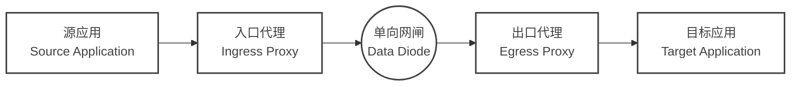
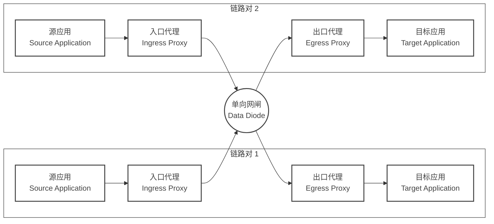
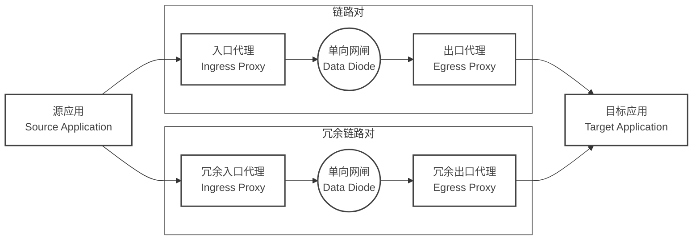
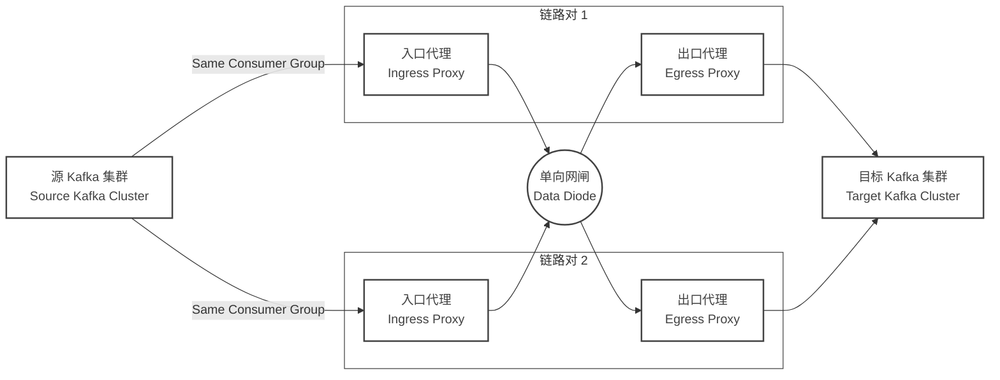

# 部署拓扑与高可用

在企业级环境中，部署网闸连接器时必须遵循**严格的一对一绑定原则**。本文档概述了基于此核心约束的架构模式与高可用 (HA) 策略。

## 核心原则：单一逻辑处理单元

根据网闸连接器的[协议设计](/zh-CN/protocol)，**入口代理（Ingress Proxy）与出口代理（Egress Proxy）构成单一的逻辑处理单元**。

*   **严格的一对一映射**：每一个入口代理实例必须对应一个专属的出口代理实例。
*   **不可复用**：**不支持**多个入口代理实例的数据由同一个出口代理实例处理，也**不支持**一个入口代理实例分发给多个出口代理实例。

### 原理说明
入口代理与出口代理内部维护着针对单一数据流的状态机（包括序列号追踪、分片重组状态）。如果多个入口代理向同一个出口代理发送数据，会导致接收端的序列号冲突和状态混乱，进而导致严重的数据包丢失和重组失败。

因此，所有的扩展和高可用设计，都必须以**成对出现的入口代理与出口代理**为基本单位。

## 部署模式

网闸连接器支持 Kubernetes 和 Docker Compose 部署，但请务必遵循上述配对原则。

### 单链路对部署模式

最基础的部署单元

- **配置**：
    - 入口代理配置唯一的目标 UDP 地址/端口。
    - 出口代理监听对应的 UDP 端口。

### 多链路对部署模式

多链路对部署模式适用于需要同时处理多个数据流的场景，每个链路对负责独立的流量隔离。

- **配置**：
    - 每个链路对的入口代理配置唯一的目标 UDP 地址/端口。
    - 每个出口代理监听对应的 UDP 端口。

## 高可用策略

鉴于 1:1 的限制，高可用不能通过简单的“后端集群负载均衡”来实现，必须采用**多链路并行**的策略。

### 冗余链路模式 (Active-Active Replication)

这是实现**最高可靠性**的推荐架构，容忍任意组件（包括物理网闸硬件）的故障。

- **流量流向**：
    - **源端**：业务应用将同一份数据同时发送给入口代理和冗余入口代理（流量镜像）。
    - **传输**：两条链路独立传输数据。
    - **目的端**：目标应用会收到两份数据（分别来自冗余出口代理和出口代理）。
- **去重要求**：目标业务系统必须具备**去重逻辑**（例如基于业务数据的唯一 ID），以处理重复到达的数据包。

### 基于 Kafka 分组消费的故障转移模式 (Active-Active Sharding)

利用 Kafka 的消费者组机制实现自动的负载分担和故障转移，同时保持 Ingress 输出流的单一性。

- **故障转移流程**：
    - 正常情况下，Kafka 将 Partition 分流给 链路对 1 和 链路对 2 的入口代理。
    - 若链路对 1 的入口代理宕机，Kafka 会触发 Rebalance，将原属于链路对 1 的 Partition 重新分配给链路对 2 的入口代理。
    - 此时，链路对 2 的入口代理承载双倍流量，但对于链路对 2 的出口代理而言，它仍然只接收来自链路对 2 的入口代理 这一单一源头的合法序列数据，**符合 1:1 协议要求**。
- **前置条件**：
    - 每个链路对的入口代理必须作为 Kafka Consumer 运行。
    - 必须规划足够的物理通道（端口）供每个入口代理-出口代理对使用。

### 冷备模式 (Active-Passive)

适用于允许秒级中断的场景。

- **机制**：
    - 利用 Kubernetes 的 `Deployment` (Replicas=1) 。
    - 或 Docker Compose 的 `restart: always`。
- **故障恢复**：当入口代理或出口代理进程崩溃时，容器编排平台自动重启实例。
- **局限**：重启期间数据传输会中断。

## “盲发”问题与监控

在单向网络中，每个入口代理**无法知道**对应的出口代理是否正常运行。

### 缓解策略
由于我们现在采用严格的配对模式，监控变得更加明确：

1. **带外监控 (Out-of-Band Monitoring)**：
    - 如果条件允许（存在管理网段），应建立外部监控系统同时检查所有入口代理和出口代理的健康状态。
    - 如果发现任意出口代理挂死，应通过自动化脚本停止对应的入口代理，迫使上游（如 Kafka）将流量转移到健康的链路。

2. **心跳检测**：
    - 协议包含 `HeartBeat` 消息。出口代理应当监控心跳接收情况，如果长时间未收到入口代理的心跳，应报警提示“链路中断”。

## 总结建议

| 场景需求 | 推荐架构 | 关键配置 |
| :--- | :--- | :--- |
| **一般生产环境** | **Kafka 分组模式** | 多个入口代理作为同一消费组进行消费；每个入口代理绑定独立出口代理；依靠 Kafka Rebalance 容错。 |
| **最高可靠性** | **冗余链路 (双发)** | 源端双发流量；部署两套独立链路；目的端去重。 |
| **资源受限/简单** | **K8s 冷备** | 单个 Pod 对；依赖 K8s 自动重启。 |

**切记**：任何时候扩容，都必须同时增加入口代理和出口代理，并配置独立的通信端口/通道，严禁多对一拓扑。

