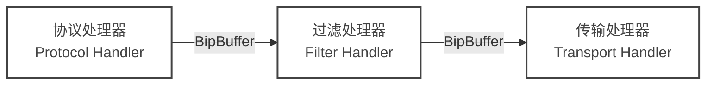

# 软件架构

网闸连接器被设计为一个高性能、模块化的软件套件，旨在促进安全的单向数据传输。本文档概述了驱动该系统的软件架构、组件交互和数据流原则。

## 架构概览

    <!-- Background Grid Pattern -->
    

    

        <!-- Ingress Node -->
        

            

                

                    

                        <i class="fa-solid fa-cloud-arrow-down text-zinc-700"></i>
                    

                    

                        <h3 class="font-semibold text-sm text-zinc-900 !my-0">入口代理</h3>
                        
高安全区

                    

                

                

                    

                        <i class="fa-brands fa-docker mr-2"></i> 协议适配
                    

                    

                        <i class="fa-solid fa-filter mr-2"></i> 深度过滤
                    

                    

                        <i class="fa-solid fa-compress-alt mr-2"></i> 极速编码
                    

                

            

        

        <!-- Diode Link -->
        

            
单向传输

            

                

                

                    <i class="fa-solid fa-arrow-down lg:fa-arrow-right text-zinc-900"></i>
                

                

            

            
物理隔离 (Air Gap)

        

        <!-- Egress Node -->
        

            

                

                    

                        <i class="fa-solid fa-cloud-arrow-up text-zinc-700"></i>
                    

                    

                        <h3 class="font-semibold text-sm text-zinc-900 !my-0">出口代理</h3>
                        
低安全区

                    

                

                

                    

                        <i class="fa-solid fa-expand-alt mr-2"></i> 极速解码
                    

                    

                        <i class="fa-solid fa-rotate mr-2"></i> 协议重组
                    

                    

                        <i class="fa-solid fa-paper-plane mr-2"></i> 目标系统
                    

                

            

        

    

网闸连接器软件分为两个独立的应用进程，它们之间从不进行双向通信：

1. **入口代理 (Ingress Proxy / 发送端)**：部署在高安全网络（源端）。它从源系统（Kafka, UDP 等）消费数据，可选择性地进行过滤，并将数据推送到单向网闸。
2. **出口代理 (Egress Proxy / 接收端)**：部署在低安全网络（目的端）。它监听来自网闸的数据，将其重新组装，并投递到目标系统。

这两个应用都共享一个用 **Rust** 编写的核心框架，优先考虑内存安全、零拷贝数据处理和高并发性。

## 流水线模型 (Pipeline Model)

在内部，入口和出口代理都基于 **流水线 (Pipeline/Chain)** 模型运行。"链 (Chain)" 定义了单个数据流在软件中的路径。你可以在单个进程中并行运行多条链（例如，同时传输多个 Kafka 主题）。

一条链由三个不同的阶段组成，通过高性能的环形缓冲区 (`BipBuffer`) 连接：

### 1. 协议处理器 (Protocol Handler)

**协议处理器**是与外部世界交互的接口。
- **入口端 (Ingress)**：它作为一个消费者 (Consumer)。它连接到源系统（例如，连接到 Kafka Broker，绑定 UDP 端口）并读取数据。它将这些数据标准化为标准的内部二进制格式。
- **出口端 (Egress)**：它作为一个生产者 (Producer)。它从网闸连接器获取标准化数据，并将其格式化为目标系统所需的格式（例如，向 Kafka Broker 生产消息，发送 UDP 数据包）。

### 2. 过滤处理器 (Filter Handler) - 可选

**过滤处理器**位于中间，负责执行安全策略。在数据载荷传递到传输层之前，对其进行检查。
- **功能**：内容检查、验证、清洗或阻断。
- **行为**：如果数据包违反规则（例如包含 "SECRET" 关键字），它将立即被丢弃并记录日志。
- **链式调用**：多个过滤器可以串联在一起，形成一个过滤链。

### 3. 传输处理器 (Transport Handler)

**传输处理器**管理跨越物理隔离/网闸的实际传输。
- **入口端 (`transport-udp-send`)**：从缓冲区获取数据，将其分片为 UDP 数据包，添加序列号头，并将其发送到网闸接口。它实现了速率限制 (`send_delay_ms`) 以防止淹没硬件设备。
- **出口端 (`transport-udp-receive`)**：在网闸接口上监听，重新排序数据包，检查缺漏（序列号），重组分片，并将完整的载荷写入下一个缓冲区。

## 数据流与内存管理

在网闸环境中，性能至关重要，因为链路通常是瓶颈，且跨越隔离间隙没有可用的“背压 (Back-pressure)”机制（如 TCP 流控）。

### 无锁缓冲 (`BipBuffer`)

网闸连接器使用单生产者单消费者 (SPSC) 的两段式缓冲区 (BipBuffer) 在线程间传递数据。
- **零分配 (Zero-Allocation)**：缓冲区在启动时预分配。
- **无锁 (Lock-Free)**：在热路径中不使用互斥锁 (Mutex) 或信号量 (Semaphore)，确保证可预测的延迟。
- **阻塞/覆盖 (Block/Overwrite)**：如果缓冲区已满（例如，网闸速度慢于 Kafka 源），协议处理器可以配置为阻塞或覆盖，有效地充当软件缓冲区以吸收突发流量。

### 线程模型
链的每个阶段都在其专用的操作系统线程中运行。
- **协议线程**：处理与外部系统的 I/O。
- **过滤/逻辑线程**：处理 CPU 密集型的验证。
- **传输线程**：专用于饱和网络链路。

这种分离确保了缓慢的过滤逻辑不会立即阻塞网络套接字，允许缓冲区吸收抖动。

## 关键设计决策

1. **无状态核心 (Stateless Core)**：核心逻辑保持最小状态。与数据包重组相关的状态是暂时的，一旦发生错误即被丢弃，以防止内存泄漏。
2. **防崩溃 (Panic-Proofing)**：架构设计具有弹性。通过提供错误包装（使用 `error_chain`），确保可恢复的错误（如临时网络故障）不会导致整个服务崩溃。
3. **可配置的延迟 vs 吞吐量**：通过 `bip_buffer_element_count` 和 `send_delay_ms`，系统管理人员可以针对低延迟（小缓冲区，低延迟）或高吞吐量（大缓冲区，批量发送）对系统进行调优。
